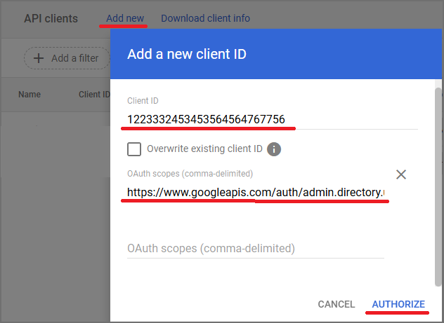
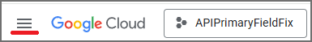
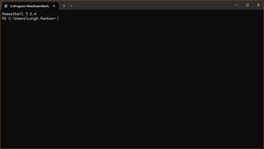

# Google Workspace User Attribute Repair (Exclaimer fix)

This script will set the `primary` flag on a user's `organizations` entry in Google Directory so it is synced with Exclaimer.

## Prerequisites

Before running this script, complete the following steps:

1. Go to https://console.cloud.google.com/ and sign in with your Super Admin account.

2. Create a new project by clicking ***“Create Project”***.


If you already have a project and it has automatically been opened, click on ***“Select a Project”*** at the top of the page next to the Google Cloud logo


In the new window, click on ***“New Project”***


3. Add a descriptive name and select your organization.

4. With the Project selected, navigate to ***“IAM & Admin > Service Accounts”***.

5. Click on ***“Create service account”***.


6. Enter a name for the service account.

7. Click on ***“Done”***.

8. Note down the ***“OAuth 2 Client ID”*** for this account

9. Click on the 3-dots in the Actions column and select ***“Manage Keys”***


10. Click on ***“Add Key”*** followed by ***“Create new key”***


11. Select JSON and click ***“Create”***


12. A JSON file will be downloaded. This will be required for the script.

---

13. Click on the ***Navigation Menu***


14. Go to ***“APIs & Services > Enabled APIs & Services”***

Click on ***“Enable APIs and services”***


Search for ***“Admin SDK API”***


Select ***“Admin SDK API”*** and then click on ***“Enable”***


15. Or, you can use the link ***“https://console.developers.google.com/apis/api/admin.googleapis.com/overview”***

---

16. Sign into the Google Admin Console in a new tab (https://admin.google.com)

17. Navigate to ***Security > Access and data control > API controls***



18. Click on ***“Manage Domain Wide Delegation”***

19. Click on ***“Add New”***

20. For Client ID, paste in the ***“OAuth 2 Client ID”*** for the service account

21. For OAuth scopes, enter in `https://www.googleapis.com/auth/admin.directory.user`

22. Click on ***“Authorize”***



---

### PowerShell Requirement

PowerShell 7 is required to run this script. To install this, please go to the following site:

Install PowerShell on Windows - PowerShell | Microsoft Learn  
https://learn.microsoft.com/en-gb/powershell/scripting/install/install-powershell-on-windows?view=powershell-7.5

---

## To run the script

Please execute the PowerShell script provided and complete the following steps:

1. Open PowerShell 7 (Press Win+R and type in ***“pwsh”*** and run)

The command window should show PowerShell 7.x.x



2. Run the command:

```powershell
Set-ExecutionPolicy -Scope Process -ExecutionPolicy Bypass; Invoke-WebRequest -Uri "https://raw.githubusercontent.com/exclaimerltd/Internal-Support-Scripts/master/GoogleAPIFieldPrimary.ps1" -OutFile "$env:TEMP\GoogleAPIFieldPrimary.ps1"; & "$env:TEMP\GoogleAPIFieldPrimary.ps1"
