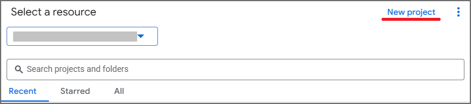

# Google Workspace User Attribute Repair (Exclaimer fix)

This script will set the `primary` flag on a user's `organizations` entry in Google Directory so it is synced with Exclaimer.

## Prerequisites

Before running this script, complete the following steps:

1. Go to [Google Cloud Console](https://console.cloud.google.com/) and sign in with your Super Admin account.

2. Create a new project by clicking **Create Project**.

3. If you already have a project and it has automatically been opened, click **Select a Project** at the top of the page next to the Google Cloud logo.

4. In the new window, click **New Project**.

5. Add a descriptive name and select your organization.  

6. With the project selected, navigate to **IAM & Admin > Service Accounts**.

7. Click **Create service account**.

8. Enter a name for the service account.

9. Click **Done**.  

10. Note down the **OAuth 2 Client ID** for this account.

11. Click on the three dots in the Actions column and select **Manage Keys**.

12. Click **Add Key** followed by **Create new key**.

13. Select **JSON** and click **Create**.  

14. A JSON file will be downloaded. This will be required for the script.

15. Click on the **Navigation Menu**.

16. Go to **APIs & Services > Enabled APIs & Services**.

17. Click **Enable APIs and services**.

18. Search for **Admin SDK API**.

19. Select **Admin SDK API** and then click **Enable**.

Alternatively, you can use this link: [Admin SDK API](https://console.developers.google.com/apis/api/admin.googleapis.com/overview)

20. Sign into the [Google Admin Console](https://admin.google.com) in a new tab.

21. Navigate to **Security > Access and data control > API controls**.

22. Click **Manage Domain Wide Delegation**.

23. Click **Add New**.

24. For **Client ID**, paste in the **OAuth 2 Client ID** for the service account.

25. For **OAuth scopes**, enter:

